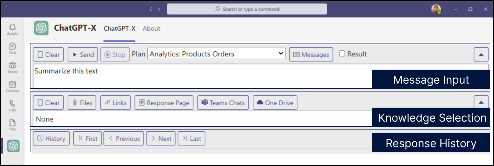

# User Guide

## Introduction

Welcome to the GPT-X User Guide. This guide provides a comprehensive overview of how to use GPT-X and all of its features.

ChatGPT-X is the front-end web application for GPT-X. It is most commonly deployed as a Micorosft Teams application.

## Overview

This section provides a general overview of the GPT-X application and its main interface elements. The image below illustrates the main sections of the user interface, and we will dive into the functionality of each component in subsequent sections.

### Message Input  
This section allows users to input their queries or commands. It includes buttons for controlling the execution of the query, such as:

- **Clear**: Clears the current input message / query.
- **Send**: Submits the query to the GPT-X model.
- **Stop**: Stops a running query.
- **Plan Selection**: Selects the current Plan (GPT-X Workflow) for the GPT-X query, which defines the scope and workflow of the action (e.g., "Analytics: Products Orders").
- **Messages**: Launches a pop-up window for selecting a message and saving desired messages for future use
- **Result**: Determines whether multiple input data sources (such as files, links, or Teams chats) are analyzed collectively as a single result, or whether each source is processed independently with separate results for each input

### Knowledge Selection  
Users can choose the data sources they want to include in the query. Available options might include:

- **Files**: Attach files to provide context or input for the query.
- **Links**: Add external links as input for the query.
- **Response Page**: Copies the response text of the previous message as the input data for a new message
- **Teams Chats**: Select Microsoft Teams chats as a data source.
- **OneDrive**: Attach OneDrive files for querying.
   
### Response History  
This section shows the previous interactions and responses from GPT-X. Users can navigate through responses using the history controls:

- **History**: Toggles the response history.
- **First, Previous, Next, Last**: Allows the user to move through past responses.

### Results
During the process and upon completion, the response of the request is displayed at the bottom of the application

- **Copy**: Copies the response text to your clipboard.
- **Download**: Downloads the response text as a text file.
- **Share**: Creates MS Teams deep link to the current response for sharing with another MS Teams user.
- **JSON** – Displays the response text in JSON file format.

## Message Input

### Message Operations

#### **Clear**
Clears the current input box. Does not remove your Plan Selection or your Knowledge Selection.

#### **Send**
Sends the current message input, Plan Selection, and Knowledge Selection for processing.

#### **Stop**
Interrupt and cancel the processing of the current request / query.

### Plan & Output Options

#### **Plan Selection**
A **Plan** in GPT-X is a structured workflow that consists of a sequence of predefined messages or prompts. These Plans guide the AI's behavior when processing input data and determining the response. By selecting a Plan, you're choosing a specific set of instructions that will be executed in a particular order, which could involve different steps like data analysis, summarization, or specific compliance checks.

Each Plan is designed to address a specific business need or task, such as “Analytics: Products Orders,” which may trigger different processes and data sources. By selecting a Plan from the dropdown, users can dynamically adapt how GPT-X interacts with the input data.

#### **Messages**
The **Messages** function in GPT-X allows users to load and manage individual prompts, which can be saved, labeled, and re-used as part of a Plan or directly in a query. Messages serve as building blocks for Plans and can be combined or sequenced to create flexible workflows.

Key capabilities include:

- **Save and Label**: Users can save important messages with specific labels for easy recall, such as "$Compliance" for frequently used compliance-related queries. 
- **Personal and Shared Messages**: Users have access to their personal saved messages, while administrators or team members with specific roles can create shared messages that are accessible to the entire team.
- **Message Integration**: Multiple messages can be loaded into the input box, allowing users to chain prompts and create more complex queries. This is especially useful for multi-step tasks where different types of analysis need to be run on the same dataset or input files.
- **Role-Based Permissions**: 
  - **Administrator**: Full control, including locking/unlocking and sharing messages.
  - **Publisher**: Can perform most operations, but cannot unlock messages.
  - **User**: Can add, modify, or delete their personal messages but cannot alter shared or locked messages.

The **Messages** tool not only enables efficient message management but also acts as a way to build and customize Plans on the fly.

#### Result Checkbox
The **Result** checkbox is a powerful option that determines how multiple input data points, as well as multiple messages, are handled in the system. Here's how it works:

- **Checked**: When the checkbox is enabled, all loaded messages and input data sources (files, links, Teams chats, etc.) will be processed **collectively**, producing a single, unified result. This is useful when you want the AI to generate a comprehensive analysis that takes all inputs into account simultaneously.
  
- **Unchecked**: If left unchecked, GPT-X will treat each loaded message and input data source **independently**, generating a separate result for each one. This mode is ideal for scenarios where you need distinct responses for each data source or message, ensuring that individual insights are not combined.

For example, if you load multiple documents into the system or have multiple saved messages applied to a query, enabling the **Result** checkbox would combine these sources and provide one holistic response, while disabling it would return separate results for each document or message.

By understanding and effectively using the **Plan**, **Messages**, and **Result checkbox**, users can tailor GPT-X to handle complex queries, adapt to different data sets, and control how results are generated based on their specific needs.

## Knowledge Selection

### Files
Attach files to provide context or input for the query.

### Links 
Add external links as input for the query.

### Response Page
Copies the response text of the previous message as the input data for a new message

### Teams Chats 
Select Microsoft Teams chats as a data source.

### OneDrive
Attach OneDrive files for querying.

### Azure FHIR Service
Select FHIR Resources to bring into context.

## Response History

### History 
Toggles the response history.

### First, Previous, Next, Last
Allows the user to move through past responses.

## Results

### Copy
Copies the processing result text to your clipboard.

### Download
Downloads the processing result text as a text file.

### Share
Creates MS Teams deep link to the current processing result text for sending to another MS Teams user for viewing of the result.

### JSON
Displays the processing result text in the form of a JSON file.